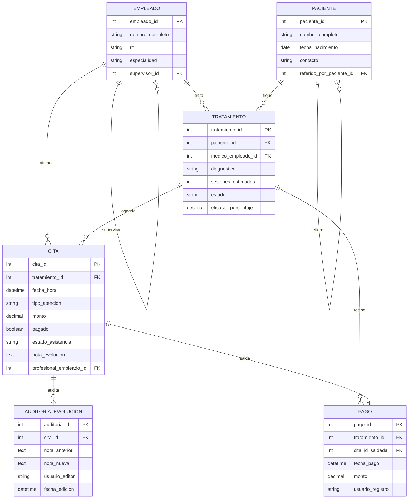

# Diagrama ER — OrthoConnect

## Vista general

El centro del modelo es el paciente. Desde ahí salen los tratamientos, las citas, los pagos y la auditoría.

## Decisiones de modelado

- `paciente` se autorrelaciona para manejar la cadena de referidos.
- `empleado` se autorrelaciona para representar el árbol de mando.
- `pago` quedó como entidad aparte para no reducir todo a un `pagado = true/false`.
- `estado_asistencia` quedó separado de `pagado` porque no significan lo mismo.
- `eficacia_porcentaje` se guarda en `tratamiento` porque se calcula al cierre.

## Cardinalidades principales

- Un médico senior puede supervisar varios juniors.
- Un médico junior puede supervisar varios técnicos o fisioterapeutas.
- Un paciente puede tener varios tratamientos.
- Un tratamiento puede tener varias citas.
- Un tratamiento puede tener varios pagos.
- Una cita puede tener varios registros en auditoría si la nota se edita más de una vez.

## Reglas reflejadas en el modelo

- Si un paciente ya tiene dos citas anteriores sin pagar, no se le puede agendar otra.
- La eficacia solo cuenta citas `ASISTIDA`.
- Cada cambio en la evolución deja rastro con valor anterior, valor nuevo, usuario y fecha.

En resumen, el diagrama se pensó para cubrir lo que pide el enunciado sin dejar pagos, jerarquía o referidos resueltos “a medias”.
