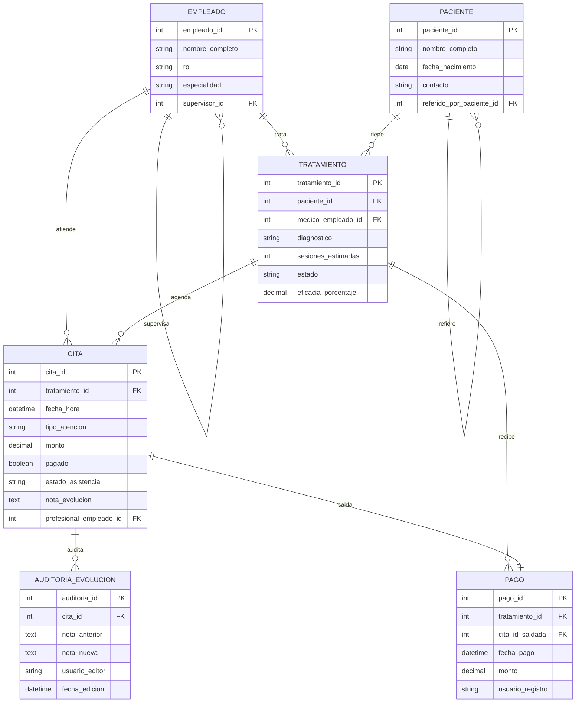

# Diagrama ER — OrthoConnect

## Vista general

El modelo está organizado alrededor del paciente, sus tratamientos, las citas ejecutadas dentro de cada tratamiento, los pagos registrados y la auditoría clínica.

## Decisiones de modelado

- `paciente` se autorrelaciona para soportar la cadena de referidos pedida en el parcial.
- `empleado` se autorrelaciona para representar el árbol de mando.
- `pago` es una entidad independiente para cumplir la rúbrica de modelado y dejar trazabilidad financiera.
- `cita.estado_asistencia` separa el hecho de haber asistido del hecho de haber pagado.
- `tratamiento.eficacia_porcentaje` se calcula por trigger al finalizar el tratamiento.

## Cardinalidades principales

- Un **médico senior** puede supervisar varios juniors.
- Un **médico junior** puede supervisar varios técnicos o fisioterapeutas.
- Un **paciente** puede tener varios tratamientos.
- Un **tratamiento** puede tener varias citas.
- Un **tratamiento** puede registrar varios pagos.
- Una **cita** puede generar múltiples registros de auditoría si la nota se edita varias veces.

## Reglas importantes reflejadas en el modelo

- Máximo una deuda pendiente efectiva antes de agendar una nueva cita; con dos anteriores sin pagar, el trigger bloquea.
- La eficacia solo considera citas `ASISTIDA`.
- Cada edición de evolución deja rastro de auditoría con `OLD` y `NEW`.
