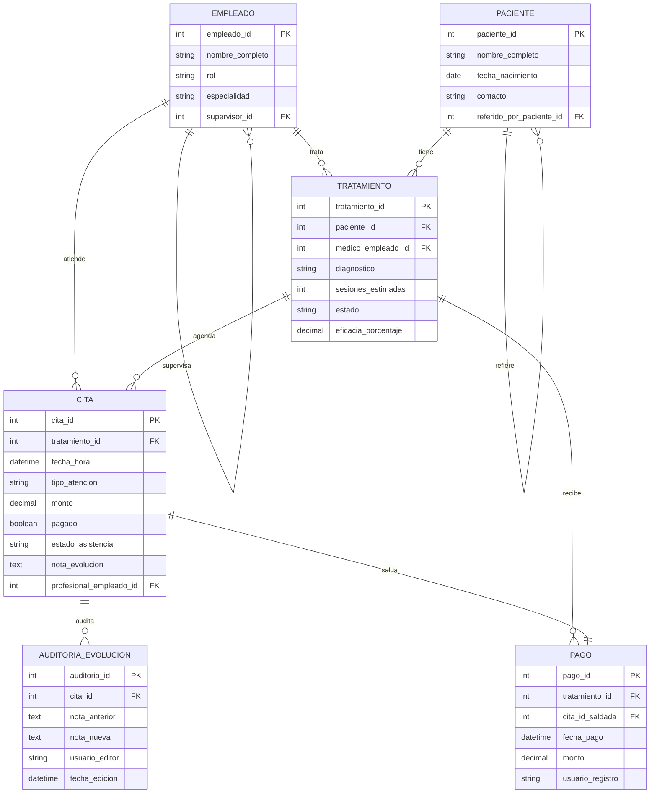

# Diagrama ER — OrthoConnect

## Decisiones de modelado

- `empleado` se autorrelaciona (`supervisor_id`) para representar el árbol de mando del enunciado.
- `paciente` se autorrelaciona (`referido_por_paciente_id`) para la cadena de referidos.
- `cita` tiene dos campos separados: `pagado` para cobranza y `estado_asistencia` para evidencia clínica. No son lo mismo — una cita puede estar pagada y no asistida, o al revés.
- `pago` es una entidad propia para dejar trazabilidad de cada transacción.
- `eficacia_porcentaje` se guarda en `tratamiento` porque el trigger la calcula una sola vez al cierre; no tiene sentido recalcularla cada vez.
